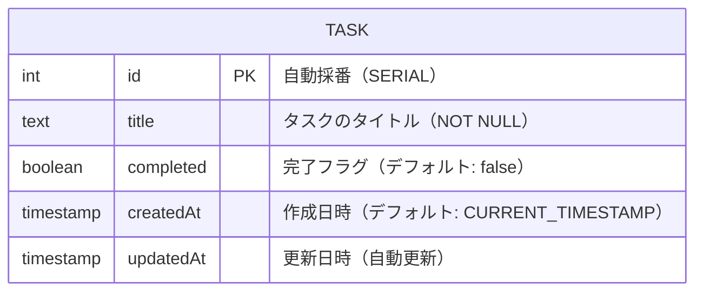

# DB スキーマ

## ER 図

## テーブル定義

### `Task` テーブル

| カラム名 | 型 | 制約 | 説明 |
|---|---|---|---|
| `id` | `INTEGER` | PK, NOT NULL, AUTO INCREMENT | タスクの一意識別子 |
| `title` | `TEXT` | NOT NULL | タスクのタイトル |
| `completed` | `BOOLEAN` | NOT NULL, DEFAULT false | 完了フラグ |
| `createdAt` | `TIMESTAMP(3)` | NOT NULL, DEFAULT CURRENT_TIMESTAMP | 作成日時 |
| `updatedAt` | `TIMESTAMP(3)` | NOT NULL | 更新日時（Prisma が自動更新） |

## マイグレーション

| マイグレーション名 | 適用日 | 内容 |
|---|---|---|
| `20260411175505_init` | 2026-04-11 | `Task` テーブルの初回作成 |

## 接続設定

- **データベース**: PostgreSQL（Neon Serverless）
- **アダプター**: `PrismaNeon`（WebSocket ベースのコネクションプール）
- **接続**: `DATABASE_URL` 環境変数から取得
- **SSL**: `sslmode=require`（必須）
