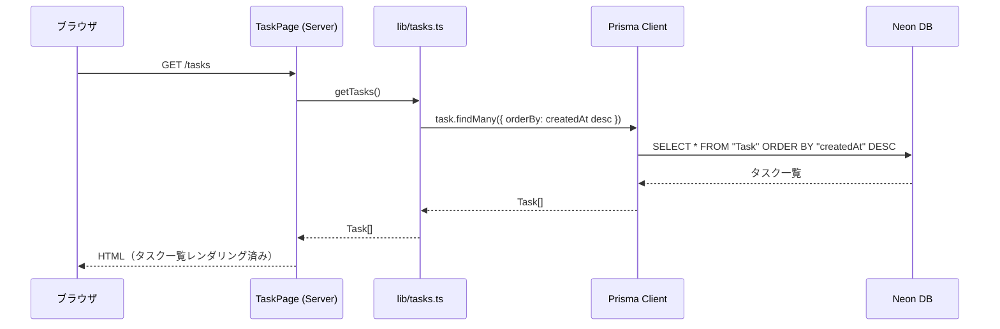
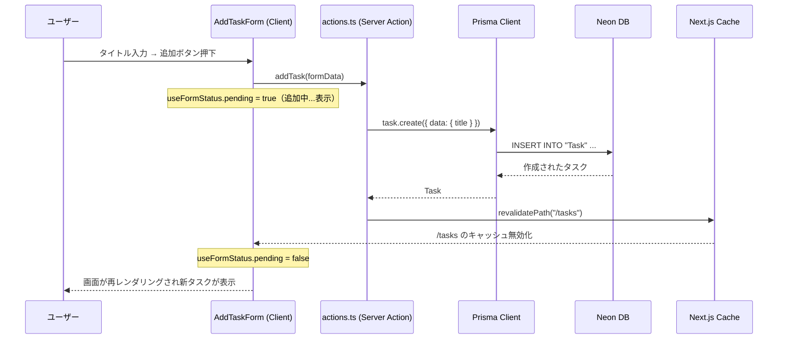
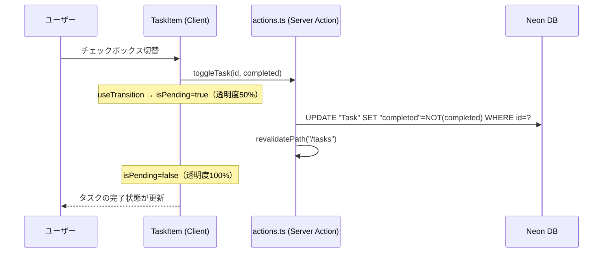
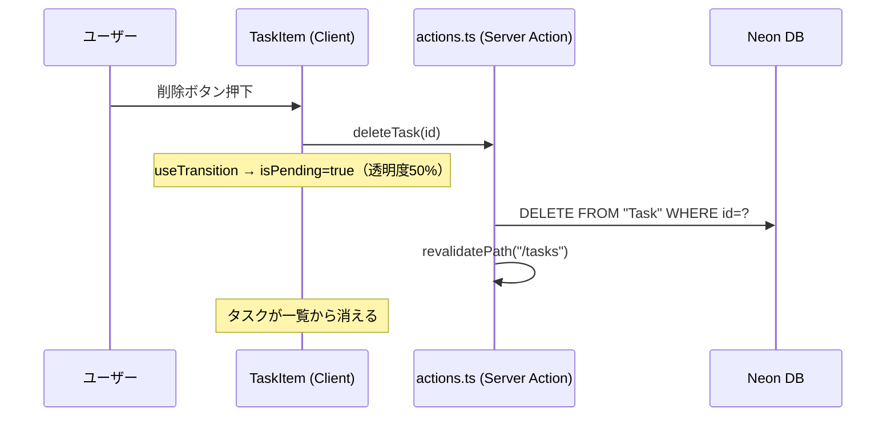

## データの持ち方

このアプリは React の状態管理ライブラリ（Zustand, Redux 等）を使用していない。データは以下の方法で管理される。

| データ | 管理場所 | 説明 |
|---|---|---|
| タスク一覧 | サーバー（DB） | `TaskPage`（Server Component）が毎回 DB から取得 |
| フォームの送信状態（Pending） | `useFormStatus` | `SubmitButton` 内で参照、フォーム送信中の UI を制御 |
| タスク操作の Pending 状態 | `useTransition` | `TaskItem` 内で参照、操作中は透明度を下げて視覚的フィードバック |

## データフロー

### タスク一覧の取得

### タスクの追加

### タスクの完了切替

### タスクの削除

