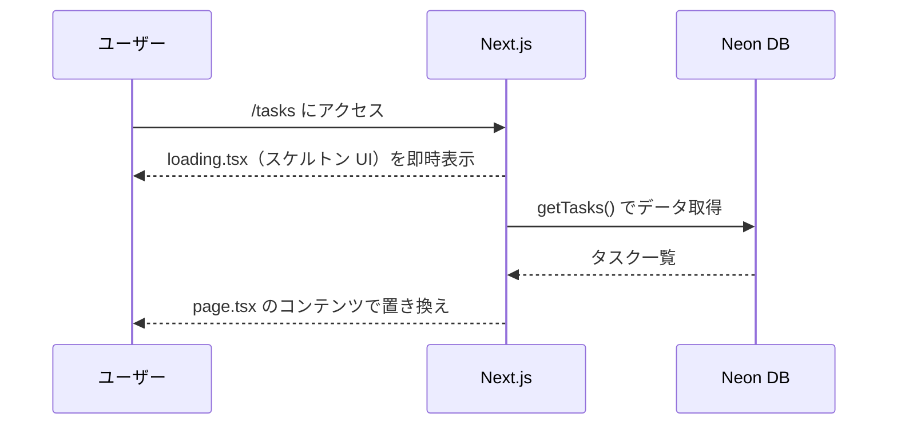

# エラーハンドリング

## エラーの種類と処理方針

| エラー種別 | 発生箇所 | 処理方針 |
|---|---|---|
| ページ/ルートが存在しない | Next.js ルーティング | `app/not-found.tsx` で 404 ページを表示 |
| タスク一覧の取得失敗 | `app/tasks/page.tsx` | `app/tasks/error.tsx` のエラー境界でキャッチし、リトライボタンを表示 |
| Server Action の失敗 | `app/tasks/actions.ts` | 現時点では明示的なエラーハンドリングなし（要確認） |

## エラー境界コンポーネント（`app/tasks/error.tsx`）

Next.js の Client Component として実装された Error Boundary。タスク一覧セグメント内でのエラーをキャッチする。

```
エラー発生
    ↓
error.tsx がレンダリング
    ↓
「もう一度試す」ボタン表示
    ↓
ユーザークリック → reset() 呼び出し → セグメントの再レンダリング
```

## ローディング UI（`app/tasks/loading.tsx`）

タスク一覧ページのデータ取得中にスケルトン UI を表示する（Next.js Suspense の自動ストリーミング）。


