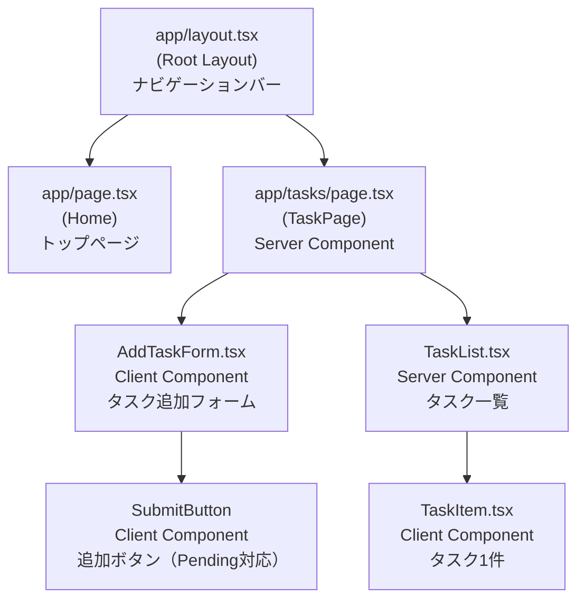

## コンポーネント階層



## 画面レイアウト（/tasks）

```
┌─────────────────────────────────┐
│ ナビゲーションバー               │
│  TaskApp          [タスク一覧]  │
├─────────────────────────────────┤
│ タスク一覧                       │
│                                 │
│ [新しいタスクを入力...] [追加]   │ ← AddTaskForm
│                                 │
│ ┌─────────────────────────────┐ │
│ │ □ タスクタイトル  日付 削除 │ │ ← TaskItem
│ └─────────────────────────────┘ │
│ ┌─────────────────────────────┐ │
│ │ ☑ 完了済みタスク  日付 削除 │ │ ← TaskItem（完了状態）
│ └─────────────────────────────┘ │
└─────────────────────────────────┘
```

## コンポーネント説明

| コンポーネント | 種別 | 役割 |
|---|---|---|
| `RootLayout` | Server Component | 全ページ共通の HTML 構造・ナビゲーションバー |
| `Home` | Server Component | トップページ。タスク一覧へのリンクボタン |
| `TaskPage` | Server Component | DB からタスク一覧を取得し、子コンポーネントに渡す |
| `AddTaskForm` | Client Component | テキスト入力と送信フォーム。`useFormStatus` で Pending 状態を管理 |
| `SubmitButton` | Client Component | `useFormStatus` で送信中は「追加中...」と表示し disabled |
| `TaskList` | Server Component | タスク配列を受け取り、空の場合はメッセージ、ある場合は `TaskItem` の一覧を表示 |
| `TaskItem` | Client Component | チェックボックス・タイトル・日付・削除ボタン。`useTransition` で操作中の Pending 状態（opacity）を制御 |
